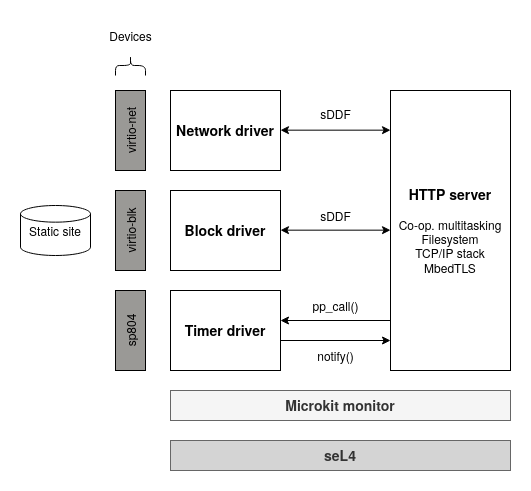

# HTTP Server

This repository demonstrates the use of the [seL4 crates](https://github.com/seL4/rust-sel4) with
the [seL4 Microkit](https://github.com/seL4/microkit). It serves a static site
(the same content as [https://sel4.systems](https://sel4.systems)) over HTTP and HTTPS. Currently, `qemu-arm-virt` is the only
supported platform.



### Rustdoc for the `sel4-microkit` crate

https://sel4.github.io/rust-sel4/views/aarch64-microkit/aarch64-sel4-microkit/doc/sel4_microkit/index.html

### Quick start

The only requirements for getting started are Git, Make, and Docker.

First, clone this respository:

```
git clone https://github.com/seL4/rust-microkit-http-server-demo.git
cd rust-microkit-http-server-demo
```

Next, build, run, and enter a Docker container for development:

```
make -C docker/ run && make -C docker/ exec
```

Inside the container, build and emulate the demo:

```
make run
```

Finally, in a browser, access http://localhost:9080 or https://localhost:9443.
